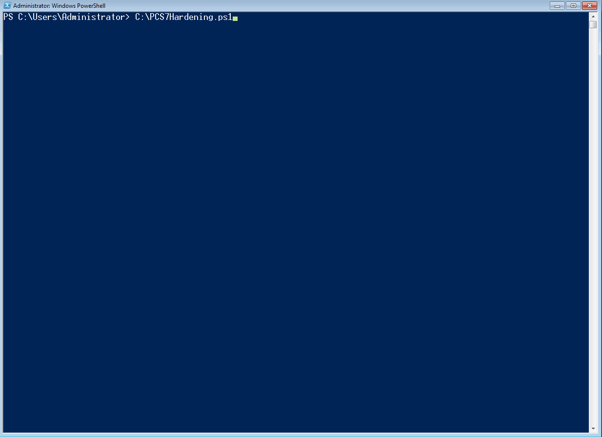

# Siemens Simatic PCS 7 Hardening Tool
## Overview
Powershell script for assessing the security configurations of Siemens - SIMATIC PCS 7 OS client, OS Server or Engineering station

## Dependencies
None! The script is Powershell 2.0 compatible. 
Powershell >=2.0 is pre-installed on every Windows since Windows 7 and Windows Server 2008R2.\
The tool was tested on:
* Windows 7
* Windows Server 2012 R2
* Windows 10
* Windows Server 2016

## Usage
Run the script as an administrator.

## Demo

## Description
Collects data from the following sources:
* Windows Management Instrumentation (WMI)
* Windows registry
* Resultant Set of Policy (RsoP)
* Security Policy
* PCS7 WebNavigator and Information server configuration files
* Running services

Analyzes the collected data according to OTORIO's profound research on Simatic PCS 7 security and hardening.
The research is based on 
* https://support.industry.siemens.com/cs/document/109782722/simatic-process-control-system-pcs-7-compendium-part-f-industrial-security-(v9-0)-?dti=0&lc=en-WW
* https://support.industry.siemens.com/cs/document/60119725/simatic-process-control-system-pcs-7-security-concept-pcs-7-wincc-(basic)?dti=0&lc=en-WW
                         
You should consult these documents in order to resolve the alerts which the tool notifies on.
                     
## Insights

| #  | Insight                                                   | Data source        | Details                                                                                                                                                                                     |
|----|-----------------------------------------------------------|--------------------|---------------------------------------------------------------------------------------------------------------------------------------------------------------------------------------------|
| 1  | GPO is not strict enough                                  | RSoP               | See table below                                                                                                                                                                             |
| 2  | Some folders are shared with everyone                     | WMI                | Permissive sharing rights put your factory at risk. See Otorio's research https://www.otorio.com/blog/two-critical-configuration-issues-discovered-in-siemens-dcs-system/                   |
| 3  | Password minimum length                                   | Security Policy    | The password length should be at least 14 characters                                                                                                                                        |
| 4  | Password complexity                                       | Security Policy    | Password complexity policy should be enforced                                                                                                                                               |
| 5  | Password cleartext                                        | Security Policy    | Forbid storing windows passwords as cleartext                                                                                                                                               |
| 6  | Encrypted communication between OS systems is not enabled | Registry           | If you enable this policy, only systems with the same Pre Shared Key(PSK) can communicate with each other via PCS 7 mechanisms                                                              |
| 7  | WinCC running with an administrator account               | WMI                | Administrative rights are not needed for operation of PCS 7 .                                                                                                                               |
| 8  | Unnecessary services are running                          | Powershell command | These services are unnecessary for the operation of the system and therefore should be disabled                                                                                             |
| 9  | Server header is not disabled                             | Registry           | This header specifies the web server version. This is a piece of information which attackers look for in the reconnaissance phase, and therefore the server shouldn't send it when replying |
| 10 | httpOnlyCookies is not enabled                            | web.config         | Enabling this header makes cookies inaccessible to the JavaScript Document.cookie API, which prevents sending them using XSS attack                                                         |
| 11 | customErrors is not enabled                               | web.config         | When this header is enabled, detailed errors are shown only to local users. Remote users are redirected to a custom error page                                                              |
| 12 | X-Frame-Options header is not enabled                     | web.config         | When enabled, this header provides clickjacking protection by not allowing rendering of a page in a frame                                                                                  |
| 13 | X-XSS-Protection header is not enabled                    | web.config         | When this header is enabled,   pages aren't loaded when they detect reflected cross-site scripting (XSS) attacks.                                                                           |
| 14 | Content Security Policy header is not enabled             | web.config         | The HTTP Content-Security-Policy response header helps guard against XSS attacks                                                                                                            |
| 15 | X-Powered-By header is enabled                            | web.config         | Indicates that the website is "powered by ASP.NET."                                                                                                                                         |

## Group policies for Insight #1
| #  | Policy                                                                 | Recommended state         |
|----|------------------------------------------------------------------------|---------------------------|
| 1  | Turn off Application Telemetry                                         | Enabled                   |
| 2  | Turn off Inventory Collector                                           | Enabled                   |
| 3  | Do not sync                                                            | Enabled                   |
| 4  | Do not sync app settings                                               | Enabled                   |
| 5  | Do not sync password                                                   | Enabled                   |
| 6  | Do not sync personalize                                                | Enabled                   |
| 7  | Do not sync Apps                                                       | Enabled                   |
| 8  | Do not sync other Windows settings                                     | Enabled                   |
| 9  | Do not sync desktop personalization                                    | Enabled                   |
| 10 | Do not sync browser settings                                           | Enabled                   |
| 11 | Do not sync on metered connections                                     | Enabled                   |
| 12 | Do not sync start settings                                             | Enabled                   |
| 13 | Turn off Automatic Root Certificates Update                            | Enabled                   |
| 14 | Turn off printing over HTTP                                            | Enabled                   |
| 15 | Turn off downloading of print drivers over HTTP                        | Enabled                   |
| 16 | Turn off Windows Update device driver searching                        | Enabled                   |
| 17 | Turn off Windows Error Reporting                                       | Enabled                   |
| 18 | Turn off access to the Store                                           | Enabled                   |
| 19 | Turn off the Windows Messenger Customer Experience Improvement Program | Enabled                   |
| 20 | Prevent the usage of OneDrive for file storage                         | Enabled                   |
| 21 | Turn off location                                                      | Enabled                   |
| 22 | Turn off Windows Location Provider                                     | Enabled                   |
| 23 | Turn off downloading of game information                               | Enabled                   |
| 24 | Turn off game updates                                                  | Enabled                   |
| 25 | Allow Cortana                                                          | Disabled                  |
| 26 | Allow search and Cortana to use location                               | Disabled                  |
| 27 | Do not allow Web search                                                | Enabled                   |
| 28 | Do not search the Web or display Web results in Search                 | Enabled                   |
| 29 | Allow indexing of encrypted files                                      | Disabled                  |
| 30 | Allow Telemetry                                                        | Enabled - Enterprise Only |
| 31 | Turn off Autoplay                                                      | Enabled on all drives     |

## Authors
Amit Porat, Roman Dvorkin, Yuval Ardon, Uri Sade from OTORIO's Research Team.

For any questions/suggestions feel free to contact us at <matan.dobr@otorio.com>
